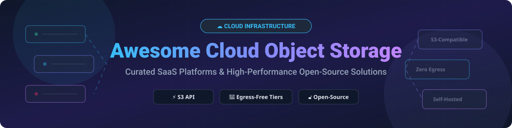

  

# ☁️ Awesome Cloud Object Storage 🚀

  
  
  
  
  

> **Curated directory of SaaS Cloud Object Storage services, S3-compatible APIs, egress-free delivery networks, and self-hosted open-source storage platforms.**

---

## 💡 Overview & SEO Guide

Welcome to the ultimate **Cloud Object Storage** resource hub. Whether you are building scalable microservices, managing large AI/ML training datasets, archiving cold data, or serving high-bandwidth media, selecting the right object storage provider is vital for optimizing performance and cloud infrastructure costs.

### 🔑 Key Concepts in Object Storage
- **S3-Compatibility**: The standard RESTful API protocol established by Amazon Web Services (AWS S3), supported by almost all modern object storage providers and SDKs.
- **Egress Fees**: Data transfer charges incurred when downloading or moving data out of a cloud provider. Zero-egress providers like **Cloudflare R2** and **Wasabi** eliminate these unpredictable charges.
- **Self-Hosted Storage**: Open-source solutions such as **MinIO**, **Ceph**, and **SeaweedFS** that allow you to deploy enterprise-grade object storage on your own hardware or Kubernetes clusters.

---

## 📖 Table of Contents

- [☁️ SaaS/Hosted Platforms](#️-saashosted-platforms)
- [🔓 Open-Source GitHub Projects](#-open-source-github-projects)
- [🤝 How to Contribute](#-how-to-contribute)
- [⚠️ Disclaimer](#️-disclaimer)
- [💖 Support & Sponsorship](#-support--sponsorship)
- [⭐ Star History](#-star-history)

---

## ☁️ SaaS/Hosted Platforms

> **📊 Market Context & Size**: The global cloud object storage market is estimated at **~$12B in 2026**, growing toward **~$30B by 2032**. The sector is **moderately concentrated** — AWS S3, Google Cloud Storage, and Azure Blob Storage hold the majority market share, while **Cloudflare R2** and **Backblaze B2** aggressively compete on **zero egress fees**. **Egress costs remain the primary price driver** for high-traffic applications: S3 charges **$0.09/GB** for egress, whereas Cloudflare R2 offers **$0/GB egress**. Enterprises routinely deploy multi-cloud storage strategies based on access patterns and bandwidth requirements.

| Platform | Description | Pricing (Starting Tier) | Free Tier / Trial Limits | Company Scale (Revenue / Valuation) |
|---|---|---|---|---|
| **[Amazon S3](https://aws.amazon.com/s3/)** 📦 | The industry-standard object storage service with 99.999999999% (11 nines) durability and 350+ global edge locations. | **S3 Standard**: **$0.023/GB-month** (first 50 TB). **Egress**: **$0.09/GB** (after 100 GB/month). **Glacier**: **$0.00099/GB-month**. | **AWS Free Tier**: **5 GB** S3 Standard storage for **12 months** (new accounts), **100 GB** monthly egress, **2,000 PUT** & **20,000 GET** requests. | **~$638B revenue (Amazon FY2025)** 🏢 |
| **[Google Cloud Storage](https://cloud.google.com/storage)** 🔍 | High-performance enterprise object storage with integrated multi-region replication and automated lifecycle management. | **Standard**: **$0.020/GB-month** (US region). **Nearline**: **$0.010/GB-month**. **Archive**: **$0.0012/GB-month**. | **Google Cloud Free Tier**: **$300 credit** for 90 days. **Always Free**: **5 GB** Standard storage, **1 GB** monthly egress. | **~$350B revenue (Alphabet FY2025)** 🏢 |
| **[Azure Blob Storage](https://azure.microsoft.com/en-us/products/storage/blobs/)** 🔷 | Scalable object storage for cloud-native workloads, deep enterprise integration, and automated data tiering. | **Hot tier**: **$0.018/GB-month** (LRS). **Cool**: **$0.010/GB-month**. **Archive**: **$0.00099/GB-month**. **Egress**: **$0.087/GB**. | **Azure Free Account**: **$200 credit** for 30 days. **5 GB** Blob storage for **12 months** (new accounts). | **~$281B revenue (Microsoft FY2025)** 🏢 |
| **[Linode Object Storage (Akamai)](https://www.linode.com/products/object-storage/)** 🌐 | Akamai Cloud infrastructure providing simple, flat-rate S3-compatible object storage with global delivery. | **Base**: **$5.00/month** (includes **250 GB** storage + **1 TB** outbound transfer). **Additional storage**: **$0.02/GB**. | **No perpetual free tier** — $5.00/month minimum base subscription. | **~$4B+ revenue (Akamai FY2025)** 🏬 |
| **[Cloudflare R2](https://www.cloudflare.com/developer-platform/r2/)** ⚡ | **Zero-egress object storage disruptor.** Fully S3-compatible API, global edge distribution, and zero data transfer charges. | **Storage**: **$0.015/GB-month**. **Class A (Write)**: **$4.50/M** requests. **Class B (Read)**: **$0.36/M** requests. **Egress**: **$0/GB**. | **Always Free Tier**: **10 GB-month** storage, **1 Million** Class A operations, and **10 Million** Class B operations per month. | **~$2.17B revenue (Cloudflare FY2025)** 📈 |
| **[DigitalOcean Spaces](https://www.digitalocean.com/products/spaces)** 🌊 | Developer-friendly S3-compatible object storage featuring built-in CDN integration and straightforward pricing. | **Base**: **$5.00/month** (includes **250 GiB** storage + **1,024 GiB** outbound transfer). **Additional storage**: **$0.02/GiB**. | **No perpetual free tier** — $5.00/month minimum base subscription. | **~$700M+ revenue (DigitalOcean FY2025)** 📈 |
| **[Wasabi Hot Cloud Storage](https://wasabi.com/)** 🌶️ | Fast, predictable cloud object storage with no egress fees or API request charges. | **Flat Rate**: **$7.99/TB/month** (~$0.00799/GB). **Egress**: **$0/GB**. **API Requests**: **$0**. | **1 TB Free Trial** for 30 days. **No perpetual free tier**. | **Private (~$250M+ revenue est.)** 🚀 |
| **[Backblaze B2](https://www.backblaze.com/cloud-storage)** 🔴 | Low-cost S3-compatible cloud object storage with generous 3x free egress and zero fee API requests. | **Storage**: **$6.95/TB/month** (~$0.00695/GB). **Egress**: **Free up to 3x** monthly average storage, then **$0.01/GB**. | **Always Free Tier**: **First 10 GB storage free forever**. Unlimited free egress to bandwidth alliance compute partners. | **Public (BLZE), ~$100M+ revenue** 📊 |
| **[Scaleway Object Storage](https://www.scaleway.com/en/object-storage/)** 🇪🇺 | Leading European cloud provider offering Multi-AZ and One-Zone S3-compatible storage with strict privacy compliance. | **Standard Multi-AZ**: **€0.016/GB-month**. **One Zone**: **€0.008/GB-month**. **Egress**: **75 GB free**, then **€0.01/GB**. | **75 GB free egress/month**. **No perpetual free storage tier**. | **Private (part of Iliad Group)** 🏢 |

---

## 🔓 Open-Source GitHub Projects

The open-source cloud object storage ecosystem is exceptionally mature. Below is a list of top open-source projects sorted by GitHub Stars_Count in descending order.

| Repo & Description | GitHub_Stars |
|---|---|
| **[MinIO](https://github.com/minio/minio)** ⚡ — **The de facto standard for S3-compatible self-hosted object storage.** High-performance, Kubernetes-native enterprise object store with erasure coding, multi-site replication, and strict S3 API compatibility. (AGPL-3.0) |  |
| **[SeaweedFS](https://github.com/seaweedfs/seaweedfs)** 🌊 — **Fast distributed storage system for blobs, objects, and files.** Optimized to handle billions of files efficiently with low latency, fast small-file processing, and native S3 API layer. (Apache-2.0) |  |
| **[Ceph](https://github.com/ceph/ceph)** 🐙 — **Unified, enterprise distributed storage cluster** delivering object (RGW S3/Swift), block (RBD), and file system (CephFS) storage in a single self-healing infrastructure. (LGPL-2.1) |  |
| **[Garage](https://github.com/deuxfleurs/garage)** 🚗 — **Lightweight S3-compatible distributed object store** engineered for self-hosted, geo-distributed multi-node clusters running on heterogeneous commodity hardware. (AGPL-3.0) |  |
| **[RustFS](https://github.com/opc-source/rustfs)** 🦀 — **High-performance distributed object storage built in Rust.** Modern MinIO alternative featuring multi-architecture binaries (amd64/arm64), Docker/Kubernetes/Helm charts, Nix Flakes, and OIDC support. (AGPL-3.0) |  |
| **[Zenko](https://github.com/scality/Zenko)** 🌐 — **Multi-cloud data controller for S3-compatible object storage.** Provides a unified data management layer across private on-premises storage and public cloud providers. (Apache-2.0) |  |
| **[OpenIO](https://github.com/openio-sds/openio)** 🗄️ — **Grid-based open-source object storage platform** designed for massive scale-out on-premises data centers and enterprise workloads. (AGPL-3.0) |  |

---

## 🤝 How to Contribute

Contributions are welcome! Follow these steps to submit a new SaaS provider or open-source tool:

1. 🍴 **Fork** this repository.
2. 📝 **Add/edit** entries in [README.md](file:///C:/Users/ishan/Documents/Projects/Awesome-Cloud-Object-Storage/README.md) adhering to the existing table layout and formatting.
3. ℹ️ **Provide essential metadata**: Name, official link, factual 1-2 sentence description, pricing structure, free tier details, and repository link.
4. 🚀 **Submit a Pull Request (PR)** with a clear title and summary.

---

## ⚠️ Disclaimer

- This repository is a **community-curated list** for informational and educational purposes.
- Cloud object storage services host mission-critical data; always evaluate encryption standards, SLA guarantees, data residency compliance, and security policies before deployment.
- **Pricing & Free Tiers**: All pricing figures and free tier details are verified at the time of publication but may change. Always inspect provider pricing pages before committing workloads.

---

## 💖 Support & Sponsorship

If you find this repository helpful, please consider supporting the project:

- ⭐ **Star** this repository on GitHub to help others discover it.
- 🔀 **Fork** it to contribute improvements or maintain your own reference copy.
- 📢 **Share** it with fellow backend engineers, platform teams, and infrastructure architects.
- ☕ **Sponsor & Buy Me a Coffee**: If you'd like to support ongoing open-source development, check out my [GitHub Sponsor Dashboard](https://github.com/sponsors/ishandutta2007). Thank you for your support!

---

## ⭐ Star History

